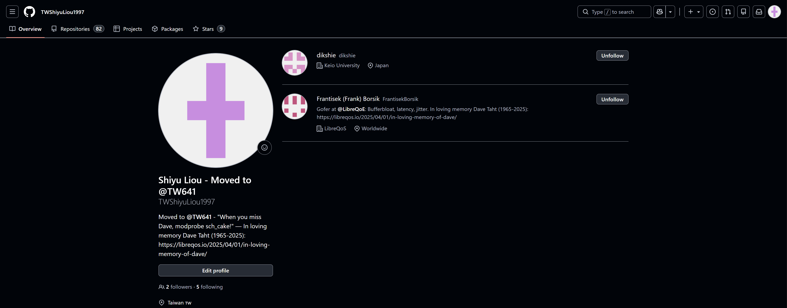
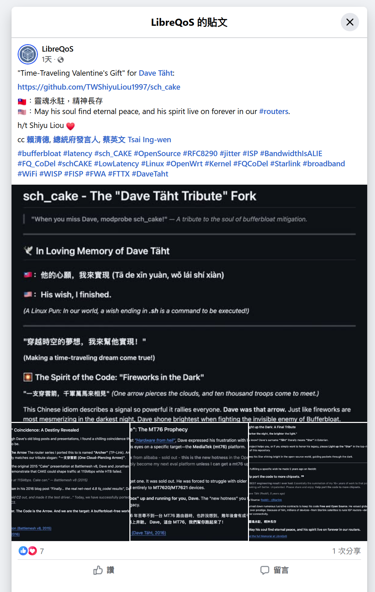
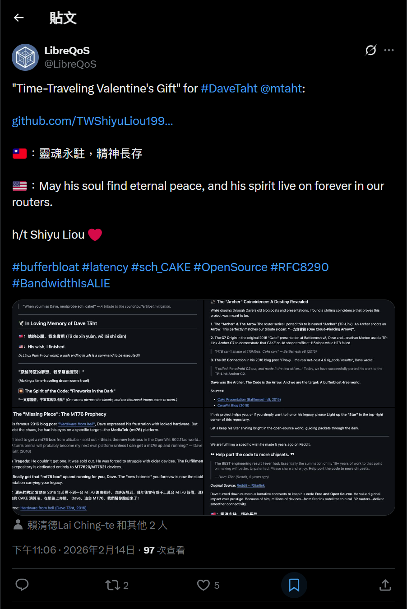
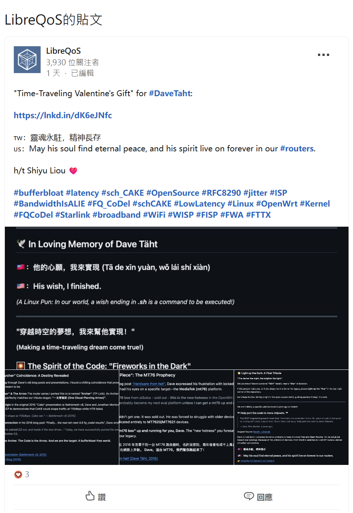
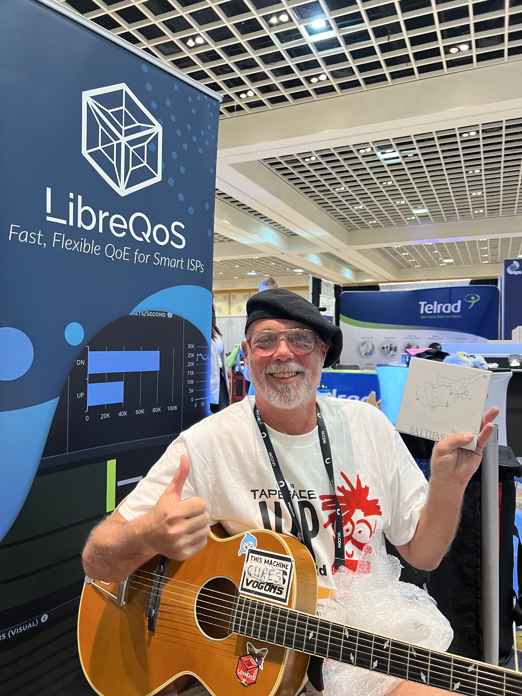
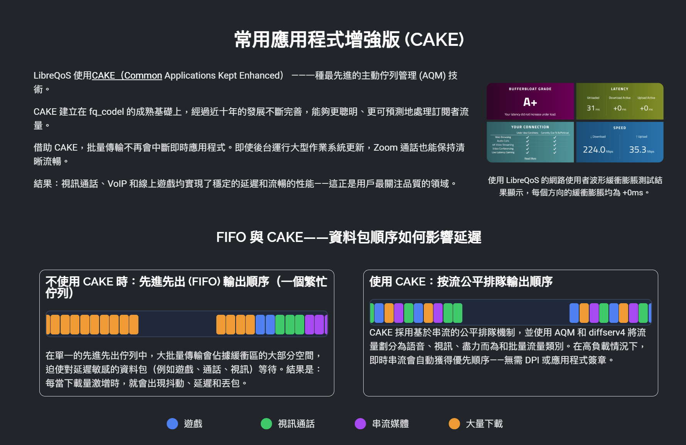
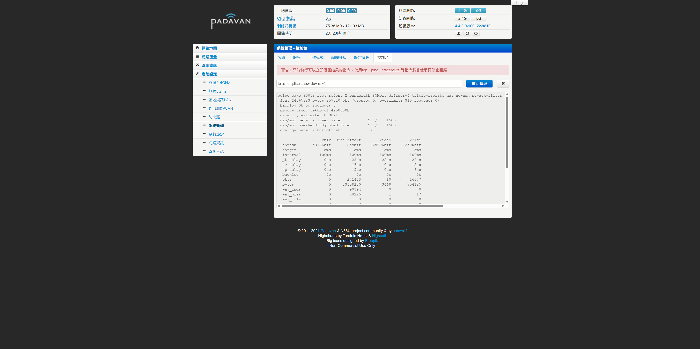

# [Padavan-CAKE](https://TW641.github.io/Padavan-CAKE/)

> [繁體中文](README_TW.md) | [简体中文](README_CN.md) | English

## <h2>⭐ Light up the Täht: A Final Tribute</h2>

<blockquote>
  <code><b><i>"The darker the night, the brighter the Täht."</i></b></code>
</blockquote>

To the world, he was the unsung hero who silently ripped the excess latency out of the Internet. To the open-source community, he was a legend known as <b>dtaht</b> on Reddit and <b>@mtaht</b> on Twitter. But behind the code was a man born <b>Michael</b>, who chose to live as <b>Dave</b>, and gave everything to connect us all.

As perhaps the final large-scale Padavan port for legacy devices, this project serves as a digital museum. Before his digital footprints fade into the void of the internet, there are forgotten stories—cold facts and warm lore—that must be preserved here.

<h3>📜 The Lore of an Internet Hero</h3>

<ul>
  <li>⚖️ <b>The Judge, The Hacker &amp; The "Disappointment":</b> Dave's father, Ron, was a respected municipal judge. Ironically, Ron once wrote that he was his own parents' "only disappointment" because he became a lawyer instead of an engineer. Decades later, Ron found himself equally baffled by his own son. Dave’s nomadic hacker lifestyle confused him. Ron would playfully grumble: <i>"Why don't you work for IBM? You've been <a href="https://blog.cerowrt.org/">fixing the internet and giving the technology away for free? Again?</a>"</i> But Dave wasn't chasing money; he was chasing a dream. Yet, Dave inherited his father's fierce sense of justice and critical thinking—a trait summarized by a tattooed ex-convict who once recognized Dave in a bar and bought him a beer, simply saying of Judge Ron: <i>"He was fair."</i>  </li>

  <li>🎨 <b>The Mother's Gift: Art &amp; Music:</b> While Dave inherited his critical thinking from his father, his boundless creativity, nomadic spirit, and deep passion for music undoubtedly came from his mother, Beverly. She was an award-winning painter, an avid world traveler, and a generous patron of the arts who even opened her home to visiting symphony musicians. Dave’s identity as a "sci-fi folk musician" carrying his guitar everywhere was a beautiful continuation of her vibrant legacy.  </li>

  <li>⚾ <b>The Alternate Universe &amp; "Extra Innings":</b> Dave cherished a vivid childhood memory of driving home with his dad, screaming at the radio during a dramatic 19-inning Phillies baseball game. Years later, Dave discovered that specific game <i>never actually happened</i> that way. His beautiful conclusion: <i>"I can only conclude that it took place in some alternate universe that only he and I shared."</i> In 2012, as Ron was dying in a hospice, he began feverishly typing blog posts with just two fingers. Dave stepped in as his editor, realizing that for the first time since he was a boy, they were collaborating rather than arguing. <i>"I didn't realize that he was in a hurry,"</i> Dave later reflected in a heartbreaking eulogy, mourning the stories his dad left untold. Yet, he was profoundly grateful his father's life went into "extra innings," allowing them to finally understand each other before the end.  </li>

  <li>🌍 <b>The Nicaragua Origin:</b> The fight against bufferbloat wasn't born in a corporate lab. It started when Dave was building OpenWrt mesh networks for the <i>One Laptop per Child (OLPC)</i> project in Nicaragua. Facing severe latency in those harsh environments, he found his lifelong mission.  </li>

  <li>🐈 <b>The "International Man of Mystery":</b> Much of the core bufferbloat mitigation was coded in open-source pioneer Eric S. Raymond’s (ESR) basement. ESR fondly recalled Dave as the "International Man of Mystery" who would crash there as a nomad, charm all the household cats, and stubbornly swear he would one day beat his friends at the hardcore board game <i>Power Grid</i>. ESR joked that if Dave earned a cent for every dollar of value he generated for the internet, he could have <i>"bought the entire country of Nicaragua and had enough left over to finance a space program."</i>  </li>

  <li>⚔️ <b>The FCC Crusader &amp; The Code You Use:</b> When the FCC threatened to lock down router firmware in 2015, Dave rallied internet pioneers to fight back. Without his crusade, custom firmware ports like this Padavan project wouldn't even be legally possible today. As John Carmack (creator of <i>DOOM</i>) famously tweeted upon his passing: <b>"There is a very good chance your packets flow through some code he wrote."</b>  </li>

  <li>🕯️ <b>Coding Through the Dark (Mike &amp; Michael):</b> In his final days in a hospice, Ron (born Mike) barely managed to type with two fingers, feverishly advocating for the Affordable Care Act. Though wealthy, he fought because he wanted the best healthcare for <i>everyone</i>. Decades later, his son Dave (born Michael) dragged a body plagued by Multiple Sclerosis and partial blindness to continuously code algorithms like CAKE, giving the best internet to <i>everyone</i> for free. Both men lived up to their family surname, <b>"Täht"</b> (which means <b>"Star"</b> in Estonian).</li>
</ul>

 

<blockquote>
  <code><b><i>Though Täht's physical world gradually faded into darkness, our digital universe continues to shine brightly because of him.</i></b></code>
</blockquote>

 

<h3>🌠 "We Are All Starstuff" (The Final Reunion)</h3>

There is a heartbreaking, yet incredibly beautiful timeline to Dave's family.

On June 9, 2012, sitting by his late father Ron's side in his final hours, Dave wrote on his blog:

<blockquote>
  <i>"Of all these things, the one viewpoint I was sure of, the one thing I believe to be true of an afterlife, such as it is, was this: "</i>  
  <i>"<code><b><i>That yes, we are all starstuff.</i></b></code>"</i>  
  <i><b>"And it made me cry to think it through."</b></i>
</blockquote>

On January 11, 2025, his mother Beverly passed away peacefully at her home, surrounded by loved ones.

Less than three months later, on April 1, 2025, Dave's own lifelong game went into its final "extra innings."

He passed away at the age of 59, joining his parents.

<blockquote>
  <code><b><i>In life, they were Stars illuminating the world.</i></b></code>  
  <code><b><i>In death, they are Starstuff illuminating the universe.</i></b></code>
</blockquote>

<h3>🎼 Coda: The Grand Finale (Dave's Guitar &amp; Fool)</h3>

Dave was a sci-fi folk musician who carried his guitar—famously bearing a sticker that read <i>"This guitar kills Vogons"</i>—everywhere. He bonded with people just as much over music as he did over code. To honor his vibrant soul, <b>OpenWrt officially named their 25.12.0 release "Dave's Guitar."</b>

Poetically, the legendary Taiwanese rock band Mayday (whose anniversary is March 29) has an iconic anthem called <a href="https://youtu.be/1j_mpwKmlJg"><b>《憨人》 (<i>Fool</i>)</b></a>. Just three days after their anniversary, on April Fools' Day, Dave passed away.

On March 29, 2020, Mayday's lead singer Ashin wrote a touching post revealing the profound mystery hidden within the Chinese title <b>《憨人》 (Fool)</b>. For engineers and hackers around the world, this is the most beautiful equation of humanity:

 

<blockquote>
  
💻 <code><b><i>憨 (Fool) = 敢 (Courage) + 心 (Heart)</i></b></code>

</blockquote>

 

Ashin wrote:

<blockquote>
  <i>"That year, I suddenly realized that the character for <code><b><i>'Fool' (憨) is made of 'Courage' (敢) placed over a 'Heart' (心).</i></b></code>"</i>  
  <i>"Then, inspiration led me to write this song..."</i>  
  <i>"<code><b><i>Let us bring this song to the courageous you, let's meet when the dawn comes.</i></b></code>"</i>
</blockquote>

This song is the absolute reflection of Dave's life. He refused the "sky full of gold" to give his algorithms (<code>FQ-CoDel</code> &amp; <code>CAKE</code>) away for free. To let the global open-source community sing along with Dave's spirit, here are the full lyrics in 4 languages, completely unabridged: Traditional Chinese, Taiwanese Romanization, English, and Official Japanese.

<b>🎤 Click to expand the full 4-Language Lyrics of "Fool" (憨人) to sing along</b>

<blockquote>
<b>我的心內感覺 人生的沈重 不敢來振動</b> 
<i>Gua e sim-lai kam-kak lin-sing e tim-tang, M-kann lai tin-tang</i> 
<i>(In my heart I feel how much seriousness there is in life, I don’t dare touch it)</i> 
<i>(僕の心は 人生の重みに 動くことを躊躇してる)</i>  

<b>我不是好子 嘛不是歹人 我只是愛眠夢</b> 
<i>Gua m-si ho kiann mah m-si phainn-lang, Gua tsi-si ai bin-bang</i> 
<i>(I’m not a good person, but I’m also not a bad person, I’m just someone who loves to dream)</i> 
<i>(僕はいいやつでも 悪いやつでもない ただ夢見がちなだけなんだ)</i>  

<b>我不願隨浪隨風 飄浪西東 親像船無港</b> 
<i>Gua m-guan sui ing sui hong phiau long se tang, Tshin-tshiunn tsun bo kang</i> 
<i>(I’m not willing to float with the tide, Like a drifting boat that cannot find a harbor)</i> 
<i>(波と風にまかせ あてもなく漂うなんて嫌だ 行き着く港のない船のように)</i>  

<b>我不願做人 奸巧鑽縫 甘願來作憨人</b> 
<i>Gua m-guan tsue lang kan khiau lang pang, Kam-guan lai tsue gong lang</i> 
<i>(I don’t want to be a devious opportunist, I’d rather be a fool)</i> 
<i>(僕は器用になんて生きたくない 不器用でいい)</i>  

<b>我不是頭腦空空 我不是一隻米蟲</b> 
<i>Gua m-si thau-nau khang khang, Gua m-si tsit tsiah bi-thang</i> 
<i>(It’s not that my head is empty, It’s not that I’m useless)</i> 
<i>(僕は頭が空っぽでも 怠け者でもない)</i>  

<b>人啊人 一世人 要安怎歡喜 過春夏秋冬</b> 
<i>Lang ah lang tsit si lang, Beh an-tsuann huann-hi kue tshun-ha tshiu-tang</i> 
<i>(People, oh! A lifetime is so long, How can we happily pass the years)</i> 
<i>(人の一生って どうやって楽しく 春夏秋冬を過ごすかさ)</i>  

<b>我有我的路 有我的夢 夢中的那個世界 甘講伊是一場空</b> 
<i>Gua u gua e loo u gua e bang, Bang-tiong e hit e se-kai kam kong i si tsit tiunn khong</i> 
<i>(I have my road, I have my dreams, Is it possible the world of my dreams is just an illusion?)</i> 
<i>(僕には僕の道が 夢がある 夢の中のあの世界は まさかまぼろし？)</i>  

<b>我走過的路 只有希望 希望你我講過的話 放在心肝內 總有一天</b> 
<i>Gua kiann kue e loo tsi-u hi-bang, Hi-bang li gua kong ke e ue pang tsai sim-kuann lai tsong u tsit-kang</i> 
<i>(On the road that I’ve traveled, I only have hope, Hope that all we’ve talked about is in our hearts, believing one day it will all come true)</i> 
<i>(僕が歩んできた道には 希望だけが 僕が話したことを 心にとめておいて いつの日かきっと)</i>  

<b>看到滿天全金條 要煞無半項 環境來戲弄</b> 
<i>Khuann-kau mua-thinn tsuan kim-tiau beh suah bo puann hang, Khuan-king lai hi-lang</i> 
<i>(Seeing gold dance through the sky, I reach out for it but grasp nothing, It’s like fate mocking me)</i> 
<i>(空いっぱいのダイヤも 一つだってつかめない 神様のいたずらで)</i>  

<b>背景無夠強 天才無夠弄 逐項是攏輸人</b> 
<i>Pue-king bo kau kiong thian-tsai bo kau lang, Tak-hang si long su lang</i> 
<i>(My background’s not good enough, my talent’s not used enough, In everything I lose to other people)</i> 
<i>(生まれも 才能もたいしたことない 勝てるものなんて無い)</i>  

<b>只好看破這虛華 不怕路歹行 不怕大雨淋</b> 
<i>Tsi-ho khuann-phua tse hi-hua, M-kiann loo phainn-kiann, M-kiann tua hoo lam</i> 
<i>(I’d best see through all this false splendor, I'm unafraid of how difficult the road ahead may be, And unafraid of being drenched in the rain)</i> 
<i>(虚栄を見抜き 険しい道 大雨を恐れないだけさ)</i>  

<b>心上一字敢 面對我的夢 甘願來作憨人</b> 
<i>Sim siong tsit li kam bin-tui gua e bang, Kam guan lai tsue gong lang</i> 
<i>(On my heart, there is one word daring, when confronting my dreams, I’m willing to be a fool)</i> 
<i>(心には勇敢の文字 夢に向って 不器用でいい)</i>  

<b>我不是頭腦空空 我不是一隻米蟲</b> 
<i>Gua m-si thau-nau khang khang, Gua m-si tsit tsiah bi-thang</i> 
<i>(It’s not that my head is empty, It’s not that I’m useless)</i> 
<i>(僕は頭が空っぽでも 怠け者でもない)</i>  

<b>人啊人 一世人 要安怎歡喜 過春夏秋冬</b> 
<i>Lang ah lang tsit si lang, Beh an-tsuann huann-hi kue tshun-ha tshiu-tang</i> 
<i>(People, oh! A lifetime is so long, How can we happily pass the years)</i> 
<i>(人の一生って どうやって楽しく 春夏秋冬を過ごすかさ)</i>  

<b>我有我的路 有我的夢 夢中的那個世界 甘講伊是一場空</b> 
<i>Gua u gua e loo u gua e bang, Bang-tiong e hit e se-kai kam kong i si tsit tiunn khong</i> 
<i>(I have my road, I have my dreams, Is it possible the world of my dreams is just an illusion?)</i> 
<i>(僕には僕の道が 夢がある 夢の中のあの世界は まさかまぼろし？)</i>  

<b>我走過的路 只有希望 希望你我講過的話 放在心肝內 總有一天</b> 
<i>Gua kiann kue e loo tsi-u hi-bang, Hi-bang li gua kong ke e ue pang tsai sim-kuann lai tsong u tsit-kang</i> 
<i>(On the road that I’ve traveled, I only have hope, Hope that all we’ve talked about is in our hearts, believing one day it will all come true)</i> 
<i>(僕が歩んできた道には 希望だけが 僕が話したことを 心にとめておいて いつの日かきっと)</i>  

<b>我有我的路 有我的夢 夢中的那個世界 甘講伊是一場空</b> 
<i>Gua u gua e loo u gua e bang, Bang-tiong e hit e se-kai kam kong i si tsit tiunn khong</i> 
<i>(I have my road, I have my dreams, Is it possible the world of my dreams is just an illusion?)</i> 
<i>(僕には僕の道が 夢がある 夢の中のあの世界は まさかまぼろし？)</i>  

<b>我走過的路 只有希望 希望你我講過的話 放在心肝內 總有一天</b> 
<i>Gua kiann kue e loo tsi-u hi-bang, Hi-bang li gua kong ke e ue pang tsai sim-kuann lai tsong u tsit-kang</i> 
<i>(On the road that I’ve traveled, I only have hope, Hope that all we’ve talked about is in our hearts, believing one day it will all come true)</i> 
<i>(僕が歩んできた道には 希望だけが 僕が話したことを 心にとめておいて いつの日かきっと)</i>  

<b>我知影總會有一天</b> 
<i>Gua tsi ing tsong u tsit-kang</i> 
<i>(I know that there will always be a day)</i> 
<i>(分かってる いつかその日が来るって)</i>  

<b>啦～啦～啦～啦～</b> 
<i>La～La～La～La～</i> 
<i>(La～La～La～La～)</i> 
<i>(声を聞かせて)</i>  

<b>我有我的路 我有我的夢</b> 
<i>Gua u gua e loo, gua u gua e bang</i> 
<i>(I have my road, I have my dreams)</i> 
<i>(僕には僕の道が 夢がある)</i>  

<b>總會有一天 總會有一天</b> 
<i>Tsong u tsit-kang, tsong u tsit-kang</i> 
<i>(One day... One day...)</i> 
<i>(いつの日かきっと... いつの日かきっと...)</i>
</blockquote>

 

 
<i>(🎧 Click the image to listen to the Live Version of "Fool")</i>

If his monumental work has ever improved your network, please honor this brilliant, selfless "Fool" by <b>Lighting up the "Star"</b> in the top-right corner of this repository.

<i>Let's keep his Star shining bright in the open-source world, guiding packets through the dark.</i> 
<i>His physical journey has ended, but as an old friend who bonded with him over music perfectly bid him farewell: </i>

<blockquote>
  <b>"Happy travels, amigo!"</b>
</blockquote>

<i>The global open-source community will carry his CAKE legacy forward:</i>

<blockquote>
  <b>(I have my own path, I have my own dream. One day... echoing through Dave's Guitar 🎸)</b>
</blockquote>

 

<h3>🔗 References &amp; Tributes</h3>
<ul>
  <li><b>Dave's Starstuff Quote (2012):</b> <a href="https://ronsravings.blogspot.com/2012/06/rip-ron-taht.html?showComment=1339262388498#c3179985587009391271">Ron's Ravings Blog Comments</a></li>
  <li><b>Ron at Hope Hospice (2012):</b> <a href="https://ronsravings.blogspot.com/2012/05/ron-at-hope-hospice.html">Ron's Ravings: Ron at Hope Hospice</a></li>
  <li><b>Extra Innings Eulogy &amp; The Alternate Universe (2012):</b> <a href="https://ronsravings.blogspot.com/2012/10/memorial-service-eulogy.html">Eulogy - "Extra Innings"</a></li>
  <li><b>Ron's Disappointment (2011):</b> <a href="https://ronsravings.blogspot.com/2011/10/normal-0-microsoftinternetexplorer4.html">The republicans admit to being half wrong...</a></li>
  <li><b>Beverly Taht Joins Ron (2025):</b> <a href="https://ronsravings.blogspot.com/2025/01/beverly-taht-joins-ron.html">Ron's Ravings: Beverly Taht Joins Ron</a></li>
  <li><b>CeroWrt Blog (Fixing the internet for free):</b> <a href="https://blog.cerowrt.org/">blog.cerowrt.org</a></li>
  <li><b>Doc Searls Weblog (2025):</b> <a href="https://doc.searls.com/2025/04/01/remembering-dave-taht/">Remembering Dave Taht (This guitar kills Vogons)</a></li>
  <li><b>"Happy travels, amigo!" (Friend's Farewell):</b> <a href="https://doc.searls.com/2025/04/01/remembering-dave-taht/#comment-33744">Doc Searls Weblog Comments (stu z)</a></li>
  <li><b>Eric S. Raymond's Tribute (2025):</b> <a href="https://x.com/esrtweet/status/1907401538093416621">X (Twitter) @esrtweet</a></li>
  <li><b>John Carmack's Tribute (2025):</b> <a href="https://x.com/ID_AA_Carmack/status/1907459628897587216">X (Twitter) @ID_AA_Carmack</a></li>
  <li><b>The Philosophy of "Fool" (憨):</b> <a href="https://www.facebook.com/ashin555/videos/%E6%86%A8%E4%BA%BA/234790114390923/">Mayday Ashin's Facebook Post (2020)</a></li>
  <li><b>The Anthem of the "Fool" (憨人) - Mayday:</b>
    <ul>
      <li>🎸 <a href="https://www.youtube.com/watch?v=olGod8i1j1o">Official Live Video (BinMusic, 2020)</a></li>
      <li>🎬 <a href="https://www.youtube.com/watch?v=1j_mpwKmlJg">Official Music Video HD (ROCK RECORDS, 2012)</a></li>
      <li>🎧 <a href="https://www.youtube.com/watch?v=lYRDRtS55b8">Pure Audio Track (Mayday - Topic, 2014)</a></li>
    </ul>
  </li>
</ul>

## 🏆 🇹🇼 World Premiere! Taiwan No.1! 🇹🇼

## 🚀 Improve Network Latency! TW641 Ported CAKE (sch_cake) Padavan Router Firmware: Cloud Compilation Guide (Supports 142 Models)

**For English version, please visit: [https://www.mobile01.com/topicdetail.php?f=110&t=7231531#92875608](https://www.mobile01.com/topicdetail.php?f=110&t=7231531#92875608)**

**繁體中文版本，請見：[https://www.mobile01.com/topicdetail.php?f=110&t=7231531#92875605](https://www.mobile01.com/topicdetail.php?f=110&t=7231531#92875605)**
 
👉 **Previous Firmware Release, Test Results & Flashing Guide:** 

[Firmware Release] [Padavan + CAKE Port] TP-Link Archer C2 V1 (with 3.4.113 Linux Kernel) & Phicomm K2P A1/A2 (with 4.4.198 Linux Kernel)

[https://www.mobile01.com/topicdetail.php?f=110&t=7220226](https://www.mobile01.com/topicdetail.php?f=110&t=7220226)

This is my independent project and the world's first successful port of the **CAKE traffic control algorithm** to Padavan (including both Linux Kernel 3.4.113 and Linux Kernel 4.4.198)!
 
Not only have I resurrected the classic TP-Link Archer C2 and Phicomm K2P, but I have also significantly expanded the supported device list. This project **accurately supports 142 router models at once**, with up to **14 multi-language packs available**!
 
## 📌 Firmware Features Overview
 
* **Kernel Breakthrough:** Provides dual versions of Linux Kernel 3.4.113 and 4.4.198, significantly ahead of the original old kernels.
* **Performance Unleashed:** Fully integrated CAKE traffic scheduling, HWNAT (Hardware Acceleration) + SFE (Software Acceleration).
* **UI Optimization:** Built-in multi-language support, with layout optimized for 1080P widescreen.
* **Stability Boost:** Fixed MT7610E wireless disconnect issues, enabled fast reconnection; the 4.4 version uses the most stable Iptables 1.8.7 and libmnl 1.0.5 combo.
* **Security Enhancements:** Fully upgraded Busybox to 1.37.0, fixing multiple high-risk CVE vulnerabilities.

*(Note: My previous older projects were hosted under my old account TWShiyuLiou1997. Now, all successful builds are centralized in the new **TW641** account. Please refer to the new repository's Actions! If you find this project helpful, please click the link below to **Follow** my GitHub account for support and encouragement!)*

👉 My New GitHub Profile (TW641): [https://github.com/TW641](https://github.com/TW641)

👉 My Old GitHub Profile (TWShiyuLiou1997): [https://github.com/TWShiyuLiou1997](https://github.com/TWShiyuLiou1997)

---

## 🌍 Recognition from the Global Open Source Community & Presidential Level! (True Digital Diplomacy)
 
**This project** was not only successfully released on Taiwanese forums but also caused a huge response in the international open-source community, which is a massive validation and surprise for me as a solo developer:

* **🇹🇼🤝🇨🇿 Endorsed by Czech Open Source Expert:**
My GitHub project successfully gained the attention and approval of **Frantisek (Frank) Borsik, COO of LibreQoS**! Frank, from **Prague, Czech Republic**, is a prominent figure in the global open-source networking community, having previously promoted the core of the well-known open-source router Turris (OpenWrt) and RF elements. This means **this project** has successfully broken into the core circle of the global "Anti-Bufferbloat" community! It's an immense honor to interact with experts from the friendly Czech Republic.

* **🇹🇼🤝🇯🇵 Cross-Border Attention from Top Japanese Network Scholar:**
Dr. Dikshie from **Keio University**, a top university in Japan, also paid attention to and endorsed **this project**! Dr. Dikshie specializes in P2P networks, internet architecture, and network science. Receiving such recognition from a heavyweight scholar who excels in underlying network infrastructure proves that the technical value of this algorithm porting is extremely high!

*[Image: Personal tracking and endorsement from LibreQoS COO and a top scholar from Keio University]*

* **🇹🇼 Presidential-level Digital Diplomacy:**
LibreQoS officially published a **tribute post** on international social platforms like X (Twitter), Facebook, and LinkedIn, praising **this project** as a **"Time-Traveling Valentine's Gift"** for Dave Täht, and unprecedentedly tagged the **President of Taiwan, Lai Ching-te, former President Tsai Ing-wen, and the Presidential Office Spokesperson**! Bringing Taiwan's open-source technical contributions to the international stage is true citizen diplomacy in action! 🇹🇼

    
    
    

*[Image: LibreQoS official tribute posts across Facebook, X, and LinkedIn]*

**👇 Need Your Support! Let the World See Taiwan's Contribution! 👇**
If you also feel passionate about this "digital diplomacy," please take 10 seconds to click the official LibreQoS social post links below to **Like, Comment, and Share**! Let this transnational tribute from Taiwan be spread to the whole world:
* 👉 **X (Twitter) Post:** [https://x.com/LibreQoS/status/2022688823361126545](https://x.com/LibreQoS/status/2022688823361126545)

* 👉 **Facebook Post:** [https://www.facebook.com/libreqos/posts/pfbid02JCNKynFeQ48FdBMFbVoAoWFDLfgiA55mH3Fyz76xKHdEU86XkxgVziWzXoRYbbT1l](https://www.facebook.com/libreqos/posts/pfbid02JCNKynFeQ48FdBMFbVoAoWFDLfgiA55mH3Fyz76xKHdEU86XkxgVziWzXoRYbbT1l)

* 👉 **LinkedIn Post:** [https://www.linkedin.com/posts/libreqos_davetaht-routers-bufferbloat-activity-7428458742301659136-YAL2](https://www.linkedin.com/posts/libreqos_davetaht-routers-bufferbloat-activity-7428458742301659136-YAL2) 

---

## 🕊️ In Loving Memory of Dave Täht (The Soul of Bufferbloat Mitigation)

*[Image Source: LibreQoS]*

> **"When you miss Dave, modprobe sch_cake!"**
>
> — *A tribute to the soul of bufferbloat mitigation.*

### **🇹🇼: 他的心願，我來實現 (Tā de xīn yuàn, wǒ lái shí xiàn)** 
### **🇺🇸: His wish, I finished.** Dave Täht (1965–2025) was a great open-source contributor in network technology. He turned down countless high-paying contracts just to keep his code free and open-source. Because of his research in the Bufferbloat field, countless devices today enjoy smooth networking.

**🏹 A Coincidence Across Time: Archer and Arrow**

There is a Chinese idiom: **"A single arrow pierces the clouds, and thousands of troops come to meet."**
 
Dave is like that cloud-piercing arrow tearing through the dark night of network congestion. Coincidentally, when he demonstrated the CAKE algorithm in 2015, the test device he used was the **TP-Link Archer C7**; in 2016, he used an **odroid C2** to test the driver.
 
Today, I successfully ported his **final legacy** to the **TP-Link Archer C2**. Dave is the Archer, this code is the Arrow, and I successfully hit the target: a beautiful world without Bufferbloat.

**🧩 A Belated Promise: The MT76 Prophecy**

In 2016, Dave wrote on his **blog** that he struggled to find a MediaTek (MT76) based router, predicting it would be the rising star of open-source networking.
 
Years later, through **this project**, I've enabled thousands of MT76 devices to smoothly run the CAKE algorithm he wrote.
 
**"Dave, I finally got this MT76 running for you!"**

**🌟 Light a Star, Let the Love Continue**
 
Dave's surname **"Täht"** means **"Star"** in Estonian. If you use my firmware, please go to the GitHub open-source memorial repository and light up that "Star" for me to continue Dave Täht's spirit!
 
* 👉 Open Source Port Code & Memorial Repository: [https://github.com/TW641/sch_cake](https://github.com/TW641/sch_cake)

* 👉 Read the full memorial article for Dave Täht (LibreQoS): [https://libreqos.io/2025/04/01/in-loving-memory-of-dave/](https://libreqos.io/2025/04/01/in-loving-memory-of-dave/)

---

## 🔧 Tech 101 | Why Does Your Network Need CAKE? 
Built on the mature foundation of fq_codel, CAKE is a state-of-the-art Active Queue Management (AQM) technology. With CAKE, heavy bulk transfers no longer interrupt real-time applications. Even if your family is downloading large files, your online games will still maintain a low Ping✅.

### 🍰 Why is it called "CAKE"? 
The name originates from the movie "2010" and the game "Portal", representing the beautiful vision that everyone gets a piece of the cake. It actually stands for Common Applications Kept Enhanced. Simply put, it ensures that when multiple people use the network, everyone still gets bandwidth, keeping things smooth and stutter-free.

### ⚙️ Quick Guide to How It Works

CAKE's primary goal is to eliminate Bufferbloat.

**Its Core Features:**
* **Traffic Shaping:** Limits ingress and egress bandwidth to ensure **network packets** don't pile up in nodes like modems.
* **Fair Queuing:** Ensures every device gets a fair share of bandwidth, preventing a single application from hogging the network.
* **Automated Management:** Compared to older QoS, CAKE usually only requires setting the download and upload bandwidth limits to achieve excellent results.

⚠️ **Note:** CAKE is relatively CPU-intensive. It may become a performance bottleneck on weaker routers when handling bandwidths over 350 Mbps.

### 🔍 How to Verify CAKE is Running Perfectly

    
    
    
    

---

## 🚀 Supported Device Matrix (Accurately Supports 142 Models)
Please find your router brand and model name below. The text inside the brackets `( )` is the **"Option Code"** you will need to input in the GitHub compilation menu later!

### 🟢 Kernel 3.4 Classic Devices (125 Options)
| **Brand (A-Z)** | **Supported Model: Product Name `(Option Code)`** |
| :--- | :--- |
| **5K** | 5K-W20 `(5K-W20)` |
| **A5** | A5-V11 16M `(A5-V11_16M)`, A5-V11 4M `(A5-V11_4M)`, A5-V11 8M `(A5-V11_8M)` |
| **ATEL** | ALR-U270 `(ALR-U270)` |
| **ASUS** | RP-AC56 `(RP-AC56)`, RT-AC1200 `(RT-AC1200)`, RT-AC1200GU `(RT-AC1200GU)`, RT-AC1200HP `(RT-AC1200HP)`, RT-AC51U `(RT-AC51U)`, RT-AC54U `(RT-AC54U)`, RT-N10 C1 `(RT-N10C1)`, RT-N11P `(RT-N11P)`, RT-N11P B1 `(RT-N11PB1)`, RT-N12+ `(RT-N12plus)`, RT-N13U B1 `(RT-N13UB1)`, RT-N14U `(RT-N14U)`, RT-N56U `(RT-N56U)`, RT-N56U GE2 `(RT-N56U-GE2)`, RT-N56U B1 `(RT-N56UB1)` |
| **BELKIN** | F9K1103 `(F9K1103)` |
| **D-Link** | DIR-300 B1 `(DIR-300B1)`, DIR-300 B7 `(DIR-300B7)`, DIR-320 B1 `(DIR-320B1)`, DIR-620 A1 `(DIR-620A1)`, DIR-620 D1 `(DIR-620D1)`, DIR-860L `(DIR-860L)`, DIR-882 `(DIR-882)` |
| **GL.iNet** | GL-MT300A `(GL-MT300A)`, GL-MT300N `(GL-MT300N)`, GL-MT300N V2 `(GL-MT300NV2)` |
| **HiWiFi** | HC5661A `(HC5661A)` |
| **Kroks** | KNDRT31R26 `(KNDRT31R26)`, KNDRT31R3 `(KNDRT31R3)` |
| **Linksys** | EA-8100 `(EA-8100)` |
| **MQMaker** | WiTi 256M `(MQ-WITI-256)`, WiTi 512M `(MQ-WITI-512)` |
| **Newifi** | Newifi D1 `(NEWIFI-D1)`, Newifi D2 `(NEWIFI-D2)`, Newifi Mini `(NEWIFI-MINI)`, Newifi Y1S `(NEWIFI-Y1S)` |
| **Nexx** | WT3020A `(WT3020A)`, WT3020H `(WT3020H)`, WT3020H 16M `(WT3020H16M)` |
| **Phicomm** | PSG1218 256M `(256PSG1218)`, PSG1218 `(PSG1218)` |
| **Samsung** | SWR1100 `(SWR1100)` |
| **Sercomm** | RT-S1010 `(RT-S1010)`, Smartbox SPI `(SMARTBOX_SPI)`, SMBX Pro NAND `(SMBXPRONAND)`, SMBX Turbo `(SMBXTURBO)` |
| **SNR** | SNR-MD1 `(SNR-MD1)`, SNR-ME1 `(SNR-ME1)`, SNR-W4N-M `(SNR-W4N-M)`, SNR-W4N-M USB `(SNR-W4N-M_USB)` |
| **Totolink** | A3004NS `(A3004NS)` |
| **TP-Link** | Archer C2 V1 `(TL_C2-V1)`, Archer C20 V1 `(TL_C20-V1)`, Archer C20 V1 16M `(TL_C20-V1_16M)`, Archer C20 V4 `(TL_C20-V4)`, Archer C20 V5 `(TL_C20-V5)`, Archer C5 V4 `(TL_C5-V4)`, Archer C50 V1 `(TL_C50-V1)`, Archer C50 V3 `(TL_C50-V3)`, Archer C50 V4 `(TL_C50-V4)`, EC220-G5 V2 `(TL_EC220_G5-V2)`, MR200 V1 `(TL_MR200-V1)`, MR3020 V3 `(TL_MR3020-V3)`, MR3420 V5 `(TL_MR3420-V5)`, WDR7300 V5 `(TL_WDR7300-V5)`, WR840N V4 `(TL_WR840N-V4)`, WR840N V4 USB `(TL_WR840N-V4_USB)`, WR840N V5 `(TL_WR840N-V5)`, WR840N V5 RU `(TL_WR840N-V5_RU)`, WR840N V6 `(TL_WR840N-V6)`, WR841N V13 `(TL_WR841N-V13)`, WR841N V13 USB `(TL_WR841N-V13_USB)`, WR841N V14 `(TL_WR841N-V14)`, WR841N V14 8M `(TL_WR841N-V14_8M)`, WR842N V5 `(TL_WR842N-V5)`, WR845N V3 `(TL_WR845N-V3)`, WR845N V4 `(TL_WR845N-V4)` |
| **Tuoshi** | TS7620N `(TS7620N)` |
| **Ubiquiti** | EdgeRouter X `(UBNT-ERX)` |
| **Unielec** | U7621-06 `(U7621-06)` |
| **Wall-AP** | Wall-AP `(WALL-AP)` |
| **Xiaomi / Redmi** | Mi Router 3 `(MI-3)`, Mi Router 3 SPI `(MI-3_SPI)`, Mi Router 3C `(MI-3C)`, Mi Router 3G `(MI-R3G)`, Mi Router 3G SPI `(MI-R3G_SPI)`, Mi Router 3G v2 `(MI-R3Gv2)`, Mi Router 3 Pro `(MI-R3PRO)`, Mi Router 3P SPI `(MI-R3P_SPI)`, Mi Router 4 `(MI-4)`, Mi Router 4A 100M `(MI-4A_100M)`, Mi Router 4C `(MI-4C)`, Mi Router Mini `(MI-MINI)`, Mi Router Nano `(MI-NANO)`, Xiaomi Router 2100 `(R2100)`, Redmi Router AC2100 `(RM-AC2100)` |
| **Youhua** | WR1200JS `(WR1200JS)` |
| **Youku** | YK-L1 `(YK-L1)`, YK-L1C `(YK-L1C)` |
| **ZBT** | WE1326 `(ZBT-WE1326)`, WE1626 `(ZBT-WE1626)`, WE826-T2 `(ZBT-WE826T2)`, WG3526 `(ZBT-WG3526)`, WG3526-32 `(ZBT-WG3526-32)`, WR8305RT `(ZBT-WR8305RT)` |
| **ZTE** | E8820S `(ZTE_E8820S)` |
| **ZyXEL / Keenetic** | KN-4G3 `(KN-4G3)`, KN-4G3B `(KN-4G3B)`, KN-EXTRA `(KN-EXTRA)`, KN-EXTRA2 `(KN-EXTRA2)`, KN-GIGA3 `(KN-GIGA3)`, KN-LITE `(KN-LITE)`, KN-LITE2 `(KN-LITE2)`, KN-LITE3 `(KN-LITE3)`, KN-LITE3B `(KN-LITE3B)`, KN-OMNI `(KN-OMNI)`, KN-OMNI2 `(KN-OMNI2)`, KN-START2 `(KN-START2)`, KN-ULTRA2 `(KN-ULTRA2)`, KN-VIVA `(KN-VIVA)` |

### 🔵 Kernel 4.4 Advanced Devices (17 Options)
| **Brand (A-Z)** | **Supported Model: Product Name `(Option Code)`** |
| :--- | :--- |
| **D-Link** | DIR-878 `(DIR-878)`, DIR-882 `(DIR-882)` |
| **JCG** | 836PRO `(JCG-836PRO)`, AC860M `(JCG-AC860M)`, Q20 `(JCG-Q20)`, Y2 `(JCG-Y2)` |
| **Motorola** | MR2600 `(MR2600)` |
| **Netgear** | BZV `(NETGEAR-BZV)` |
| **Newifi** | Newifi 3 `(NEWIFI3)` |
| **Phicomm** | K2P `(K2P)`, K2P Nano `(K2P-NANO)`, K2P USB `(K2P-USB)` |
| **Xiaomi / Redmi** | CR660x `(CR660x)`, Mi Router 3G `(MI-R3G)`, Mi Router 3 Pro `(MI-R3P)`, Redmi Router 2100 `(RM2100)` |
| **XiaoYu** | XY-C1 `(XY-C1)` |

---

## 🌐 Supports 14 Languages 
I believe the internet has no borders. The firmware build environment now supports 14 languages:
* **English_Only** (Default)
* **CN** - **Traditional Chinese (Taiwan)**, simply enter `CN` in the menu to get it.
* Also includes: Russian (RU), Czech (CZ), German (DE), French (FR), totaling 14 languages.

---

## 🍰 A PIECE OF CAKE! Super Easy Cloud Compilation (No Local Environment Needed, Done in 5 Mins!) 
It's truly a piece of cake! I have integrated all settings into GitHub Actions. You don't need to know how to code at all. Just click your mouse, and you'll get your customized firmware in minutes!

### **👉 6 Simple Steps:**

**Step 1: Register/Log in to GitHub and Light a "Star" 🌟 (In Memory of Dave Täht)**
 
Go to GitHub to register a free account and log in. Please visit the memorial repository and **click** the **"Star ⭐"** in the top right corner to pay tribute to Dave!
 
👉 [https://github.com/TW641/sch_cake](https://github.com/TW641/sch_cake)

**Step 2: Select Your Router Model and Fork the Project**
 
Based on the code you found in the table above, enter the corresponding link and **click** the **"Fork"** button in the top right corner:
 
🟢 **Classic Devices (Kernel 3.4)** 👉 [https://github.com/TW641/padavan-builder-workflow](https://github.com/TW641/padavan-builder-workflow)
 
🔵 **Advanced Devices (Kernel 4.4)** 👉 [https://github.com/TW641/padavan-4.4](https://github.com/TW641/padavan-4.4)

**Step 3: Enable Actions**
 
Go to your Forked project, **click** the **"Actions"** tab at the top, and **click** the green button **"I understand my workflows, go ahead and enable them"**.

**Step 4: Select the Correct Workflow**
 
On the left side of the Actions page, **click** the corresponding workflow name based on your model:
 
🟢 **3.4 Models:** `Build firmware (Ultimate Fix - Early Size Check)`
 
🔵 **4.4 Models:** `Custom-Router-Build-Final-Fix`

**Step 5: One-Click Compile & Customize (IP/Password)**
 
**Click** the **"Run workflow"** dropdown menu on the right.
 
**[Most Important Step]** Enter your **"Option Code"** in the `Target Model` field (must perfectly match the one in the brackets from the table); for the language menu, enter `English_Only` (or `CN` if you prefer **Traditional Chinese**).
 
**Customization:** You can directly modify the default IP and password in the JSON field. If untouched, default values will be used. Finally, **click** the green **"Run workflow"** button!

**Step 6: Download & Flash**
 
Wait for about 10-15 minutes. Once the workflow shows a green checkmark ✅, **click** into the run, scroll to the bottom, and find **"Artifacts"** to download the ZIP file. The `.bin` file inside is your exclusive firmware!
