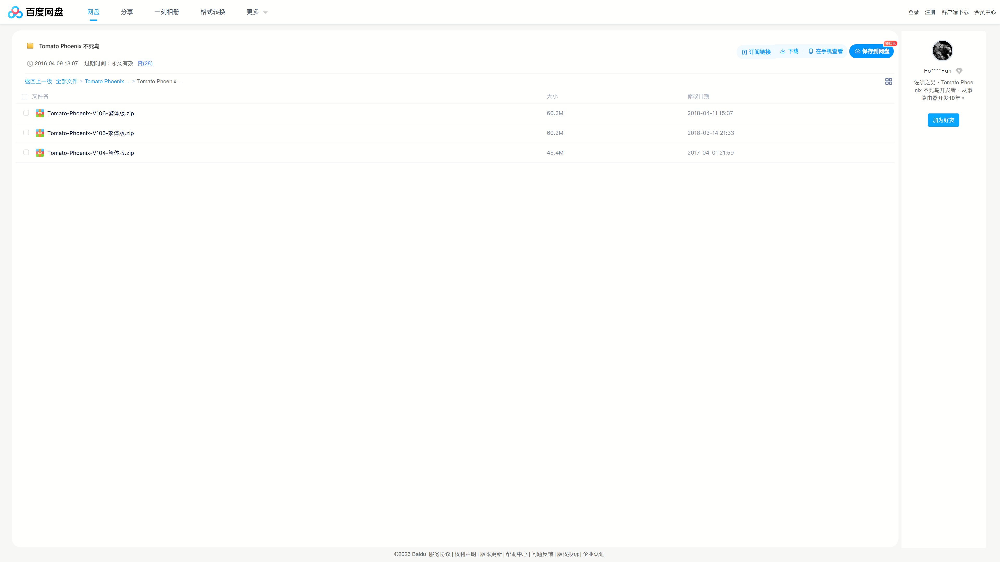
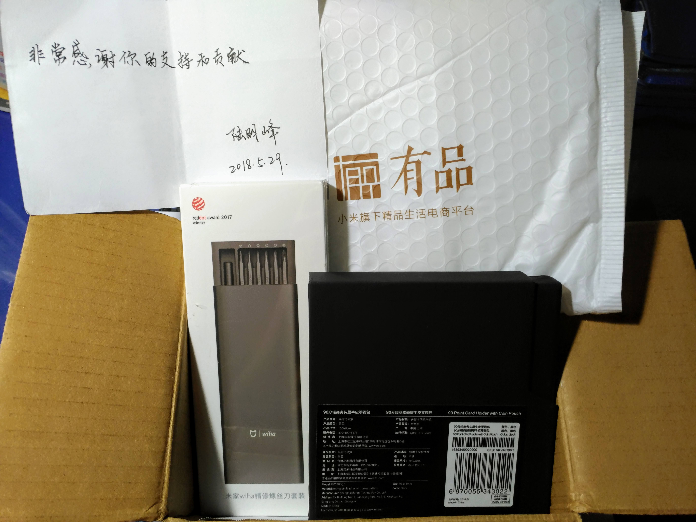
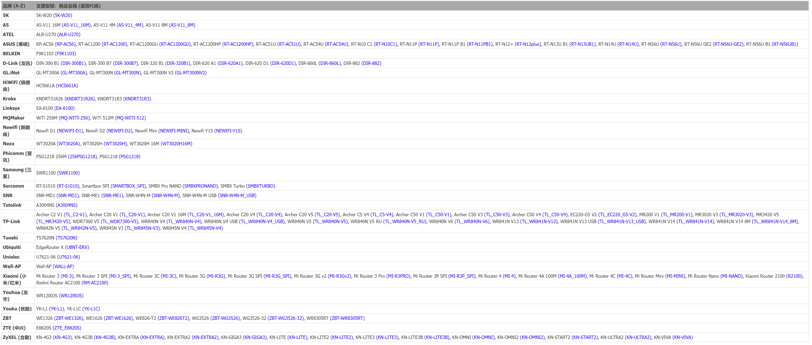
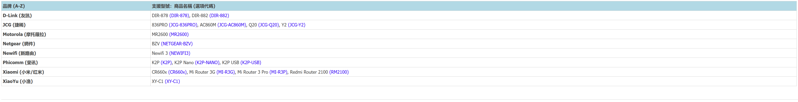

# [Padavan-CAKE](https://TW641.github.io/Padavan-CAKE/)

> [繁體中文](README_TW.md) | 简体中文 | [English](README.md)

## <h2>⭐ 点亮星辰：最后的致敬</h2>

<blockquote>
  <code><b><i>“夜愈暗，星星 (Täht) 就愈亮。”</i></b></code>
</blockquote>

对这个世界而言，他是位默默将网络过高延迟拔除的无名英雄。对开源社区来说，他是 Reddit 上的 <b>dtaht</b>、Twitter 上的 <b>@mtaht</b> 传奇。但在这些代码背后，他是一个出生名为 <b>Michael</b>，却选择以 <b>Dave</b> 之名活着，并为了连接我们所有人而奉献一切的男人。

这或许是旧世代设备最后一个大规模的 Padavan 移植项目，它同时也像是一座数字博物馆。在他留下的数字足迹消散于互联网的虚无之前，这里必须保存下那些被遗忘的故事——无论是冰冷的技术事实，还是温暖的传奇事迹。

<h3>📜 一位互联网英雄的传奇故事</h3>

<ul>
  <li>⚖️ <b>法官、黑客与“令人失望的孩子”：</b>Dave 的父亲 Ron 是一位受人尊敬的市政法官。讽刺的是，Ron 曾写道他是自己父母“唯一的失望”，因为他成了律师而不是工程师。几十年后，Ron 发现自己同样对亲生儿子感到困惑。Dave 游牧般的黑客生活方式让他不解，Ron 常半开玩笑地抱怨：“你为什么不去 IBM 上班？你又在<a href="https://blog.cerowrt.org/">免费修复网络还把技术白白送人？又来了？</a>”但 Dave 追求的不是金钱，而是梦想。然而，Dave 继承了父亲强烈的正义感与批判性思考能力——这项特质曾被一位满身刺青的前科犯总结过；那人有次在酒吧认出 Dave 并请他喝了杯啤酒，对法官 Ron 只说了一句：“他很公正。”  </li>

  <li>🎨 <b>母亲的礼物：艺术与音乐：</b>Dave 从父亲那里继承了批判性思考，但他无边的创造力、游牧精神以及对音乐的深厚热爱，无疑是来自他的母亲 Beverly。她是一位屡获殊荣的画家、热爱环游世界的旅人，也是慷慨的艺术赞助者，甚至曾敞开家门接待来访的交响乐团音乐家。Dave 带着吉他四处流浪的“科幻民谣音乐人”身份，正是她充满活力之遗产的最美延续。  </li>

  <li>⚾ <b>平行宇宙与“延长赛”：</b>Dave 珍藏着一段生动的童年回忆：他和爸爸开车回家时，对着收音机里一场戏剧性的 19 局费城人队棒球赛大声狂吼。几年后，Dave 发现那场特定的比赛<b>其实根本不是那样发生的</b>。他得出了极美的结论：“我只能推论，这件事发生在只有我和他共享的某个平行宇宙里。”2012 年，当 Ron 在安宁病房临终前，他开始狂热地用两根手指敲打着博客文章。Dave 成了他的编辑，并意识到自从他还是个小男孩以来，这是他们第一次合作而不是争吵。“我不知道他原来赶着时间，”Dave 后来在一篇令人心碎的悼词中回忆道，哀悼着父亲未及诉说的故事。然而，他无比感激父亲的生命进入了“延长赛”，让他们能在最后一刻终于理解了彼此。  </li>

  <li>🌍 <b>尼加拉瓜的起源：</b>对抗缓冲膨胀 (Bufferbloat) 的战役并非诞生于企业实验室。它始于 Dave 在尼加拉瓜为<b>“每个孩子一台笔记本电脑 (OLPC)”</b>项目建置 OpenWrt 网状网络的时候。在那些严苛的环境中面对严重的网络延迟，他找到了自己一生的使命。  </li>

  <li>🐈 <b>“国际神秘客”：</b>许多核心的缓冲膨胀缓解代码，都是在开源先驱 Eric S. Raymond (ESR) 的地下室里写出来的。ESR 深情地回忆 Dave 就像个“国际神秘客”，他会像游牧民族一样来借宿，迷倒家里所有的猫，还固执地发誓总有一天要在硬核桌游<b>《电力公司 (Power Grid)》</b>中击败朋友们。ESR 开玩笑说，如果 Dave 为互联网创造的每一美元价值能让他赚进一分钱，他就能“买下整个尼加拉瓜，而且剩下的钱还足够资助一个太空计划”。  </li>

  <li>⚔️ <b>FCC 十字军与你正在使用的代码：</b>2015 年，当美国联邦通信委员会 (FCC) 威胁要锁死路由器固件时，Dave 号召了互联网先驱们起身反抗。若没有他当年的抗争，像这个 Padavan 项目这样的自定义固件，在今天甚至在法律上都是不可能存在的。正如<b>《毁灭战士 (DOOM)》</b>创作者 John Carmack 在 Dave 过世时那句著名的推文：<b>“你传送的数据包，有很高的机率流经了他写的代码。”</b>  </li>

  <li>🕯️ <b>在黑暗中写代码 (Mike 与 Michael)：</b>Ron（出生名 Mike）在安宁病房的最后日子里，勉强用两根手指打字，狂热地倡导着《平价医疗法案》。尽管家境富裕，他仍努力奋战，因为他希望<b>所有人</b>都能获得最好的医疗保健。几十年后，他的儿子 Dave（出生名 Michael）拖着被多发性硬化症与部分失明折磨的身躯，持续编写着像 CAKE 这样的算法，将最好的网络免费送给<b>所有人</b>。这两个男人都无愧于他们的家族姓氏 <b>"Täht"</b>（在爱沙尼亚语中意为<b>“星星”</b>）。</li>
</ul>

 

<blockquote>
  <code><b><i>（尽管 Täht 的物理世界逐渐褪入黑暗，我们的数字宇宙却因为他而持续闪耀着。）</i></b></code>
</blockquote>

 

<h3>🌠 “我们都是星尘”—— 最终的团聚</h3>

Dave 的家庭有一段令人心碎，却又无比美丽的时间线。

2012 年 6 月 9 日，Dave 坐在已故父亲 Ron 身旁陪伴他度过最后时光，在博客写下：

<blockquote>
  <i>“在所有这些事情中，我确信的一个观点，一个我认为死后世界如果是真的话，那就是：”</i>  
  <i>"<code><b><i>（是的，我们都是星尘。）</i></b></code>"</i>  
  <i><b>“这让我一想到就忍不住落泪。”</b></i>
</blockquote>

2025 年 1 月 11 日，他的母亲 Beverly 在挚爱家人的陪伴下，于家中平静辞世。

不到三个月后，2025 年 4 月 1 日，Dave 自己一生的比赛也进入了最后的“延长赛”。

他在 59 岁时离世，与父母团聚。

<blockquote>
  <code><b><i>（在世时，他们是照亮世界的星星。）</i></b></code>  
  <code><b><i>（逝世后，他们是点亮宇宙的星尘。）</i></b></code>
</blockquote>

<h3>🎼 终章：盛大的落幕 — Dave 的吉他与憨人</h3>

Dave 是一位科幻民谣音乐人，他总是带着他的吉他四处走动——那把吉他上贴着著名的贴纸：“这把吉他能杀死佛贡人 (Vogons)”。他通过音乐与人建立的连接，丝毫不亚于通过代码。为了纪念他充满活力的灵魂，<b>OpenWrt 官方将其 25.12.0 版本命名为 "Dave's Guitar"</b>。

充满诗意的是，台湾传奇摇滚乐团五月天（成军纪念日为 3 月 29 日）有一首标志性的神曲叫 <a href="https://youtu.be/1j_mpwKmlJg"><b>《憨人》 (<i>Fool</i>)</b></a>。就在他们纪念日的短短三天后，在愚人节 (April Fools' Day) 当天，Dave 离开了我们。

2020 年 3 月 29 日，五月天主唱阿信写下了一篇动人的贴文，揭示了中文曲名<b>《憨人》 (Fool)</b> 里隐藏的深刻奥秘。对全世界的工程师与黑客来说，这是人性中最美的方程式：

 

<blockquote>
  
💻 <code><b><i>憨 (Fool) = 敢 (Courage) + 心 (Heart)</i></b></code>

</blockquote>

 

阿信写道：

<blockquote>
  <i>“那年，突然发现代表着愚笨的<code><b><i>‘憨’字，是‘心’上一个‘敢’。</i></b></code>”</i>  
  <i>“然后灵感带我写下了这首歌……”</i>  
  <i>“<code><b><i>让我们为你带来这首‘憨人’，与勇敢的你，约在曙光来临之时。</i></b></code>”</i>
</blockquote>

这首歌绝对是 Dave 一生的真实写照。他拒绝了“满天全金条（满天的财富）”，选择将他的算法（<code>FQ-CoDel</code> 与 <code>CAKE</code>）免费白白送人。为了让全球开源社区能随着 Dave 的精神一起高唱，以下是完整未删减的 4 种语言歌词：简体中文、台语罗马拼音、英文与官方日文。

<b>🎤 点击展开 4 种语言《憨人》完整歌词</b>

<blockquote>
<b>我的心内感觉 人生的沉重 不敢来振动</b> 
<i>Gua e sim-lai kam-kak lin-sing e tim-tang, M-kann lai tin-tang</i> 
<i>(In my heart I feel how much seriousness there is in life, I don’t dare touch it)</i> 
<i>(僕の心は 人生の重みに 動くことを躊躇してる)</i>  

<b>我不是好子 嘛不是歹人 我只是爱眠梦</b> 
<i>Gua m-si ho kiann mah m-si phainn-lang, Gua tsi-si ai bin-bang</i> 
<i>(I’m not a good person, but I’m also not a bad person, I’m just someone who loves to dream)</i> 
<i>(僕はいいやつでも 悪いやつでもない ただ夢見がちなだけなんだ)</i>  

<b>我不愿随浪随风 飘浪西东 亲像船无港</b> 
<i>Gua m-guan sui ing sui hong phiau long se tang, Tshin-tshiunn tsun bo kang</i> 
<i>(I’m not willing to float with the tide, Like a drifting boat that cannot find a harbor)</i> 
<i>(波と風にまかせ あてもなく漂うなんて嫌だ 行き着く港のない船のように)</i>  

<b>我不愿做人 奸巧钻缝 甘愿来作憨人</b> 
<i>Gua m-guan tsue lang kan khiau lang pang, Kam-guan lai tsue gong lang</i> 
<i>(I don’t want to be a devious opportunist, I’d rather be a fool)</i> 
<i>(僕は器用になんて生きたくない 不器用でいい)</i>  

<b>我不是头脑空空 我不是一只米虫</b> 
<i>Gua m-si thau-nau khang khang, Gua m-si tsit tsiah bi-thang</i> 
<i>(It’s not that my head is empty, It’s not that I’m useless)</i> 
<i>(僕は頭が空っぽでも 怠け者でもない)</i>  

<b>人啊人 一世人 要安怎欢喜 过春夏秋冬</b> 
<i>Lang ah lang tsit si lang, Beh an-tsuann huann-hi kue tshun-ha tshiu-tang</i> 
<i>(People, oh! A lifetime is so long, How can we happily pass the years)</i> 
<i>(人の一生って どうやって楽しく 春夏秋冬を過ごすかさ)</i>  

<b>我有我的路 有我的梦 梦中的那个世界 甘讲伊是一场空</b> 
<i>Gua u gua e loo u gua e bang, Bang-tiong e hit e se-kai kam kong i si tsit tiunn khong</i> 
<i>(I have my road, I have my dreams, Is it possible the world of my dreams is just an illusion?)</i> 
<i>(僕には僕の道が 夢がある 夢の中のあの世界は まさかまぼろし？)</i>  

<b>我走过的路 只有希望 希望你我讲过的话 放在心肝内 总有一天</b> 
<i>Gua kiann kue e loo tsi-u hi-bang, Hi-bang li gua kong ke e ue pang tsai sim-kuann lai tsong u tsit-kang</i> 
<i>(On the road that I’ve traveled, I only have hope, Hope that all we’ve talked about is in our hearts, believing one day it will all come true)</i> 
<i>(僕が歩んできた道には 希望だけが 僕が话说したことを 心にとめておいて いつの日かきっと)</i>  

<b>看到满天全金条 要煞无半项 环境来戏弄</b> 
<i>Khuann-kau mua-thinn tsuan kim-tiau beh suah bo puann hang, Khuan-king lai hi-lang</i> 
<i>(Seeing gold dance through the sky, I reach out for it but grasp nothing, It’s like fate mocking me)</i> 
<i>(空いっぱいのダイヤも 一つだってつかめない 神様のいたずらで)</i>  

<b>背景无够强 天才无够弄 逐项是拢输人</b> 
<i>Pue-king bo kau kiong thian-tsai bo kau lang, Tak-hang si long su lang</i> 
<i>(My background’s not good enough, my talent’s not used enough, In everything I lose to other people)</i> 
<i>(生まれも 才能もたいしたことない 勝てるものなんて無い)</i>  

<b>只好看破这虚华 不怕路歹行 不怕大雨淋</b> 
<i>Tsi-ho khuann-phua tse hi-hua, M-kiann loo phainn-kiann, M-kiann tua hoo lam</i> 
<i>(I’d best see through all this false splendor, I'm unafraid of how difficult the road ahead may be, And unafraid of being drenched in the rain)</i> 
<i>(虚栄を見抜き 険しい道 大雨を恐れないだけさ)</i>  

<b>心上一字敢 面对我的梦 甘愿来作憨人</b> 
<i>Sim siong tsit li kam bin-tui gua e bang, Kam guan lai tsue gong lang</i> 
<i>(On my heart, there is one word daring, when confronting my dreams, I’m willing to be a fool)</i> 
<i>(心には勇敢の文字 夢に向って 不器用でいい)</i>  

<b>我不是头脑空空 我不是一只米虫</b> 
<i>Gua m-si thau-nau khang khang, Gua m-si tsit tsiah bi-thang</i> 
<i>(It’s not that my head is empty, It’s not that I’m useless)</i> 
<i>(僕は頭が空っぽでも 怠け者でもない)</i>  

<b>人啊人 一世人 要安怎欢喜 过春夏秋冬</b> 
<i>Lang ah lang tsit si lang, Beh an-tsuann huann-hi kue tshun-ha tshiu-tang</i> 
<i>(People, oh! A lifetime is so long, How can we happily pass the years)</i> 
<i>(人の一生って どうやって楽しく 春夏秋冬を過ごすかさ)</i>  

<b>我有我的路 有我的梦 梦中的那个世界 甘讲伊是一场空</b> 
<i>Gua u gua e loo u gua e bang, Bang-tiong e hit e se-kai kam kong i si tsit tiunn khong</i> 
<i>(I have my road, I have my dreams, Is it possible the world of my dreams is just an illusion?)</i> 
<i>(僕には僕の道が 夢がある 夢の中のあの世界は まさかまぼろし？)</i>  

<b>我走过的路 只有希望 希望你我讲过的话 放在心肝内 总有一天</b> 
<i>Gua kiann kue e loo tsi-u hi-bang, Hi-bang li gua kong ke e ue pang tsai sim-kuann lai tsong u tsit-kang</i> 
<i>(On the road that I’ve traveled, I only have hope, Hope that all we’ve talked about is in our hearts, believing one day it will all come true)</i> 
<i>(僕が歩んできた道には 希望だけが 僕が話したことを 心にとめておいて いつの日かきっと)</i>  

<b>我有我的路 有我的梦 梦中的那个世界 甘讲伊是一场空</b> 
<i>Gua u gua e loo u gua e bang, Bang-tiong e hit e se-kai kam kong i si tsit tiunn khong</i> 
<i>(I have my road, I have my dreams, Is it possible the world of my dreams is just an illusion?)</i> 
<i>(僕には僕の道が 夢がある 夢の中のあの世界は まさかまぼろし？)</i>  

<b>我走过的路 只有希望 希望你我讲过的话 放在心肝内 总有一天</b> 
<i>Gua kiann kue e loo tsi-u hi-bang, Hi-bang li gua kong ke e ue pang tsai sim-kuann lai tsong u tsit-kang</i> 
<i>(On the road that I’ve traveled, I only have hope, Hope that all we’ve talked about is in our hearts, believing one day it will all come true)</i> 
<i>(僕が歩んできた道には 希望だけが 僕が話したことを 心にとめておいて いつの日かきっと)</i>  

<b>我知影总有一天</b> 
<i>Gua tsi ing tsong u tsit-kang</i> 
<i>(I know that there will always be a day)</i> 
<i>(分かってる いつかその日が来るって)</i>  

<b>啦～啦～啦～啦～</b> 
<i>La～La～La～La～</i> 
<i>(La～La～La～La～)</i> 
<i>(声を聞かせて)</i>  

<b>我有我的路 我有我的梦</b> 
<i>Gua u gua e loo, gua u gua e bang</i> 
<i>(I have my road, I have my dreams)</i> 
<i>(僕には僕の道が 夢がある)</i>  

<b>总有一天 总有一天</b> 
<i>Tsong u tsit-kang, tsong u tsit-kang</i> 
<i>(One day... One day...)</i> 
<i>(いつの日かきっと... いつの日かきっと...)</i>
</blockquote>

 

 
<i>(🎧 点击图片聆听《憨人》万人合唱版)</i>

如果他这项不朽的杰作曾经改善过您的网络，请点击这个项目右上角的 <b>"Star (星星)"</b> 来点亮它，以纪念这位才华横溢、无私奉献的“憨人”。

让我们让他的星星在开源世界里持续闪耀，在黑暗中引导着数据包前行。 
他的物理旅程已经结束，但正如一位与他因音乐结缘的老朋友，对他所作出的最完美告别：

<blockquote>
  <b>“旅途愉快，老朋友！”</b>
</blockquote>

全球的开源社区将带着他的 CAKE 遗产继续前进：

<blockquote>
  <b>“我有我的路 我有我的梦，总有一天... 弹奏着 Dave's Guitar 🎸”</b> 
  <i>(Gua u gua e loo, gua u gua e bang, tsong u tsit-kang... tuann-tsau Dave's Guitar 🎸)</i> 
  <i><b>(I have my own path, I have my own dream. One day... echoing through Dave's Guitar 🎸)</b></i> 
  <i>(僕には僕の道が 夢がある。いつの日かきっと... Dave's Guitar 🎸 を奏でながら)</i>
</blockquote>

 

<h3>🔗 参考文献与致敬</h3>
<ul>
  <li><b>Dave 的星尘语录 (2012):</b> <a href="https://ronsravings.blogspot.com/2012/06/rip-ron-taht.html?showComment=1339262388498#c3179985587009391271">Ron's Ravings Blog Comments</a></li>
  <li><b>Ron 于安宁病房 (2012):</b> <a href="https://ronsravings.blogspot.com/2012/05/ron-at-hope-hospice.html">Ron's Ravings: Ron at Hope Hospice</a></li>
  <li><b>“延长赛”悼词与平行宇宙 (2012):</b> <a href="https://ronsravings.blogspot.com/2012/10/memorial-service-eulogy.html">Eulogy - "Extra Innings"</a></li>
  <li><b>Ron 的“唯一失望” (2011):</b> <a href="https://ronsravings.blogspot.com/2011/10/normal-0-microsoftinternetexplorer4.html">The republicans admit to being half wrong...</a></li>
  <li><b>Beverly 辞世与 Ron 团聚 (2025):</b> <a href="https://ronsravings.blogspot.com/2025/01/beverly-taht-joins-ron.html">Ron's Ravings: Beverly Taht Joins Ron</a></li>
  <li><b>CeroWrt 博客 (免费修复网络):</b> <a href="https://blog.cerowrt.org/">blog.cerowrt.org</a></li>
  <li><b>Doc Searls Weblog (2025):</b> <a href="https://doc.searls.com/2025/04/01/remembering-dave-taht/">Remembering Dave Taht (This guitar kills Vogons)</a></li>
  <li><b>“旅途愉快，老朋友！”:</b> <a href="https://doc.searls.com/2025/04/01/remembering-dave-taht/#comment-33744">Doc Searls Weblog Comments (stu z)</a></li>
  <li><b>Eric S. Raymond 的致敬 (2025):</b> <a href="https://x.com/esrtweet/status/1907401538093416621">X (Twitter) @esrtweet</a></li>
  <li><b>John Carmack 的致敬 (2025):</b> <a href="https://x.com/ID_AA_Carmack/status/1907459628897587216">X (Twitter) @ID_AA_Carmack</a></li>
  <li><b>“憨”字的哲学:</b> <a href="https://www.facebook.com/ashin555/videos/%E6%86%A8%E4%BA%BA/234790114390923/">五月天阿信 Facebook 贴文 (2020)</a></li>
  <li><b>“憨人”神曲 - 五月天:</b>
    <ul>
      <li>🎸 <a href="https://www.youtube.com/watch?v=olGod8i1j1o">官方 Live 版 (相信音乐, 2020)</a></li>
      <li>🎬 <a href="https://www.youtube.com/watch?v=1j_mpwKmlJg">官方 MV HD (滚石唱片, 2012)</a></li>
      <li>🎧 <a href="https://www.youtube.com/watch?v=lYRDRtS55b8">纯音轨版 (Mayday - Topic, 2014)</a></li>
    </ul>
  </li>
</ul>

## 🏆全球首发！

## 🚀 改善网络延迟！TW641 移植 CAKE (sch_cake) Padavan 路由器固件：云端编译懒人包 (支持 142 款机型)

**TW641 移植 CAKE (sch_cake) Padavan 路由器韌體：雲端編譯懶人包 (支援 142 款機型)-Padavan-恩山无线论坛 - Powered by Discuz!**

**[简体中文版请见一楼！]**

**<https://www.right.com.cn/forum/forum.php?mod=viewthread&tid=8465588&fromuid=1047490&fromuser=TW641>**

**TW641 移植 CAKE (sch_cake) Padavan 路由器韌體：雲端編譯懶人包 (支援 142 款機型)-Padavan-恩山无线论坛 - Powered by Discuz!**

**[For English version, please see the 2nd floor!]**

**<https://www.right.com.cn/forum/forum.php?mod=redirect&goto=findpost&ptid=8465588&pid=22706932&fromuid=1047490&fromuser=TW641>**

**TW641 移植 CAKE (sch_cake) Padavan 路由器韌體：雲端編譯懶人包 (支援 142 款機型)-Padavan-恩山无线论坛 - Powered by Discuz!**

**[繁體中文版請見三樓！]**

**<https://www.right.com.cn/forum/forum.php?mod=redirect&goto=findpost&ptid=8465588&pid=22707025&fromuid=1047490&fromuser=TW641>**

👉 **上一篇固件分享、实测结果与刷机教程：**

[固件分享]【Padavan + CAKE 移植】TP-Link Archer C2 V1 (with 3.4.113 Linux Kernel) & 斐讯 Phicomm K2P A1/A2 (with 4.4.198 Linux Kernel)

<https://www.mobile01.com/topicdetail.php?f=110&t=7220226>

这是我个人独立完成、世界上第一个成功将 **CAKE 流量控制算法**移植到 Padavan (包含 Linux Kernel 3.4.113 与 Linux Kernel 4.4.198 两种 Linux 内核版本) 的**本项目**！

我不仅复活了经典的 TP-Link Archer C2 与 斐讯 Phicomm K2P，这次更加码扩充支持机型选项，**一口气精准支持 142 种路由器机型选项**，并拥有多达 **14 种多国语言包的支持**！

---

**🎉 特别致谢区块：**

感谢以下前辈与伙伴在开源与网络技术领域的启发与贡献：

* **🏢 企业与组织：**
    * GL.iNet 深圳市广联智通科技有限公司 ( <https://www.gl-inet.cn/> )
    * GL.iNet GL Technologies (Hong Kong) Limited ( <https://www.gl-inet.com/> )
    * LibreQoS LibreQoE, LLC ( <https://libreqos.io/> )
* **💻 开发者与贡献者：**
    * Alfie Zhao
    * Allen Liu
    * Dave Täht
    * Frantisek Borsik (Frank)
    * Jacqueline Wang
    * Wingsley Yik
    * 佐须之男 (ForgotFun) [@佐须之男](https://www.right.com.cn/forum/space-uid-46505.html)

**💡 特别回忆录：那些年我们一起搞的第三方固件**

其实当年我是负责 Tomato Phoneix 不死鸟的繁体中文翻译。

下方附上当年 Tomato Phoneix 不死鸟的百度网盘下载链接与历史截图：

<http://pan.baidu.com/s/1jIGpbQe>

请看下方图片！这是我当年和陆明峰、佐须之男合作时，他亲手写的感谢纸条和送的礼物。

我直到今天都还留着，而且这些感谢如今都仍记在心里！

**🤝 支持佐须之男 (ForgotFun)：**

这不是我的账号，但就让我们一起帮他一把吧，感谢他多年来的开源贡献。如果您想支持他，请前往他的官方网站了解支持方式：

<https://www.tomato.org.cn/donate-us.html>

<https://forgotfun.org/helpus.html>

> *「佐须之男长期致力于国内第三方免费固件的开发，期间靠的是广大用户的支持才能坚持到现在。一路走来的过程中有喝彩也有唏嘘，但我从未停止过脚步，并希望我能继续再坚持下去。希望广大的用户在力所能及的前提下能给予我些赞助，让这份梦想得以延续。」*

顺带一提，最近在论坛看到有版友发帖问：恩山为什么没有gl-inet版块？( <https://www.right.com.cn/forum/forum.php?mod=viewthread&tid=8463592&fromuid=1047490&fromuser=TW641> )

借着这篇技术分享，我也想在此向管理员许愿：**强烈希望能开立一个 GL.iNet 专属板块！** 这样大家讨论相关技术跟固件会更方便集中！

---

### 📌 固件版本特色速览

* **内核突破：** 提供 Linux Kernel 3.4.113 与 4.4.198 双版本，大幅领先原厂旧内核。
* **性能解放：** 全系列整合 CAKE 流量调度、HWNAT (硬件加速) + SFE (软件加速)。
* **界面优化：** 内建繁体中文 (支持替换简体)，并针对 1080P 宽屏幕进行排版优化。
* **稳定提升：** 修复 MT7610E 无线驱动断线问题，启用快速重连；4.4 版本采用最稳定的 Iptables 1.8.7 与 libmnl 1.0.5 组合。
* **安全防护：** 全面升级 Busybox 1.37.0，修复多个 CVE 高风险漏洞。

*(注：我先前的旧项目放在旧账号 TWShiyuLiou1997，现在成功运作的成品都会集中在新的 **TW641** 账号中，两个主页我都放在下面，请以新仓库的 Actions 为主哦！如果您觉得这个项目有帮助到您，请帮我点击下方链接 **Follow** 我的 GitHub 账号给予支持与鼓励！)*

👉 我的全新 GitHub 主页 (TW641)：<https://github.com/TW641>

👉 我的旧版 GitHub 主页 (TWShiyuLiou1997)：<https://github.com/TWShiyuLiou1997>

---

## 🌍 来自国际开源界的肯定！

**本项目**不仅在技术论坛发布，更在国际开源社区引起了巨大的反响，这对身为唯一开发者的我来说，是极大的肯定与惊喜：

* **来自捷克的国际开源大神的亲自认可：** 我的 GitHub 项目成功获得了 **LibreQoS 运营长 Frantisek (Frank) Borsik** 的亲自追踪与肯定！Frank 来自**捷克布拉格地区**，在国际开源网络界大有来头，曾负责知名开源路由器 Turris (OpenWrt) 以及 RF elements 的核心推广。这代表**本项目**已经成功打入全球「对抗 Bufferbloat (缓冲膨胀)」社区的最核心圈！能与来自捷克的专家交流，真的是莫大的荣幸。
* **来自日本的顶尖网络学者的跨国关注：** 来自日本顶尖名校 **庆应义塾大学 (Keio University) 的 Dikshie 博士** 也亲自给予**此项目**关注与认可！Dikshie 博士专攻 P2P 网络、互联网架构与网络科学，能获得这类精于底层网络基础设施的重量级学者肯定，证明了这份算法移植的技术含金量极高！

  
   
  <em><small>[图说：来自捷克 LibreQoS 运营长与日本庆应大学顶尖学者的亲自追踪认可]</small></em>

* **官方社区致敬：** LibreQoS 官方甚至在其各大国际社交平台上发布了**发文致敬**，将**这个项目**誉为给 Dave Täht 的 **"Time-Traveling Valentine's Gift" (穿越时空的情人节礼物)**！能让开源技术贡献跃上国际版面，真的是非常感动的时刻！大家有兴趣可以去搜索 LibreQoS 官方账号查看。

---

## 🕊️ In Loving Memory of Dave Täht (纪念缓冲膨胀缓解之魂)

*<small>[图片来源: LibreQoS]</small>*

> **"When you miss Dave, modprobe sch_cake!"**
> — *A tribute to the soul of bufferbloat mitigation.*

### **他的心愿，我来实现**
### **His wish, I finished.**
Dave Täht (1965–2025) 是一位伟大的网络技术开源贡献者。他生前拒绝了无数高薪合约，只为了将他的代码保持免费与开源。因为他在 Bufferbloat (缓冲膨胀) 领域的研究，今天无数的设备才能享有顺畅的网络。

**🏹 穿越时空的巧合：Archer (弓箭手) 与 Arrow (箭)**
有句成语说：**「一支穿云箭，千军万马来相见」**
Dave 就像是那支划破网络拥塞黑夜的穿云箭。巧合的是，当年他于 2015 年展示 CAKE 算法时，使用的测试机是 **TP-Link Archer C7**；2016 年他用 **odroid C2** 做测试驱动。
今天，我成功将他的这项**遗作**移植到了 **TP-Link Archer C2** 身上。Dave 是那位弓箭手 (Archer)，这段代码是那支箭 (Arrow)，而我成功命中了目标：一个没有 Bufferbloat 的美好世界。

**🧩 迟来的约定：MT76 的预言**
2016 年，Dave 曾在**博客**写下他苦寻不到一台基于 MediaTek (MT76) 的路由器，他预言这会是未来开源网络的新星。几年后的今天，我透过**这个项目**，让成千上万台 MT76 设备顺利跑起了他撰写的 CAKE 算法。
**"Dave，这台 MT76，我终于帮你跑起来了！"**

**🌟 点亮星星，让爱延续**
Dave 的姓氏 **"Täht"** 在爱沙尼亚语中正是**「星星」**的意思。如果您使用了我的固件，请到 GitHub 开源项目纪念仓库上帮我点亮那颗「Star」，延续 Dave Täht 的精神！

👉 开源移植代码与纪念仓库：<https://github.com/TW641/sch_cake

👉 阅读完整的 Dave Täht 纪念文章 (LibreQoS)：<https://libreqos.io/2025/04/01/in-loving-memory-of-dave/>

---

## 🔧 科普小教室｜为什么你的网络需要 CAKE？

CAKE 建立在 fq_codel 的成熟基础上，是一种最先进的主动队列管理 (AQM) 技术。借助 CAKE，大量传输不再中断即时应用程序。即使家人在下载大文件，你的在线游戏依然能维持低 Ping 值✅。

### 🍰 为什么叫 "CAKE" (蛋糕)？
这个名字源自电影《2010》与游戏《Portal》，代表着「人人都有蛋糕吃」的美好愿景。它实际上是 Common Applications Kept Enhanced 的缩写。简单来说，它能让网络在多人使用时，依然人人有带宽，顺畅不卡顿。

### ⚙️ 快速看懂运作原理

CAKE 最主要的目标是消除 Bufferbloat（缓冲膨胀）。
**它的核心功能：**

1.  **流量整形 (Shaping)：** 限制进出带宽，确保**网络数据包**不会在调制解调器等节点堆积。
2.  **公平排队 (Fair Queuing)：** 确保每个设备都能公平分配到带宽，防止单一程序霸占网络。
3.  **自动化管理：** 相比旧型的 QoS，CAKE 通常只需设定下载与上传带宽即可达到极佳效果。

⚠️ **注意：** CAKE 比较消耗 CPU 性能。在硬件较弱的路由器上处理超过 350 Mbps 以上的带宽时，可能会成为性能瓶颈。

### 🔍 怎么确认 CAKE 完美运行

    
    
    
    

---

## 🚀 Supported Device Matrix (精准支持 142 种机型选项清单)

请先在下方找到你的路由器品牌与商品名称，括号 **( )** 内的就是稍后在 GitHub 编译菜单中需要输入的**「选项代码」**！

### 🟢 Kernel 3.4 经典老爷机 (共 125 种选项)

*(注：若下方图片无法加载，请直接参考下方的文字表格)*

| 品牌 (A-Z) | 支持型号：商品名称 `(选项代码)` |
| :--- | :--- |
| **5K** | 5K-W20 `(5K-W20)` |
| **A5** | A5-V11 16M `(A5-V11_16M)`, A5-V11 4M `(A5-V11_4M)`, A5-V11 8M `(A5-V11_8M)` |
| **ATEL** | ALR-U270 `(ALR-U270)` |
| **ASUS (华硕)** | RP-AC56 `(RP-AC56)`, RT-AC1200 `(RT-AC1200)`, RT-AC1200GU `(RT-AC1200GU)`, RT-AC1200HP `(RT-AC1200HP)`, RT-AC51U `(RT-AC51U)`, RT-AC54U `(RT-AC54U)`, RT-N10 C1 `(RT-N10C1)`, RT-N11P `(RT-N11P)`, RT-N11P B1 `(RT-N11PB1)`, RT-N12+ `(RT-N12plus)`, RT-N13U B1 `(RT-N13UB1)`, RT-N14U `(RT-N14U)`, RT-N56U `(RT-N56U)`, RT-N56U GE2 `(RT-N56U-GE2)`, RT-N56U B1 `(RT-N56UB1)` |
| **BELKIN** | F9K1103 `(F9K1103)` |
| **D-Link (友讯)** | DIR-300 B1 `(DIR-300B1)`, DIR-300 B7 `(DIR-300B7)`, DIR-320 B1 `(DIR-320B1)`, DIR-620 A1 `(DIR-620A1)`, DIR-620 D1 `(DIR-620D1)`, DIR-860L `(DIR-860L)`, DIR-882 `(DIR-882)` |
| **GL.iNet** | GL-MT300A `(GL-MT300A)`, GL-MT300N `(GL-MT300N)`, GL-MT300N V2 `(GL-MT300NV2)` |
| **HiWiFi (极路由)** | HC5661A `(HC5661A)` |
| **Kroks** | KNDRT31R26 `(KNDRT31R26)`, KNDRT31R3 `(KNDRT31R3)` |
| **Linksys** | EA-8100 `(EA-8100)` |
| **MQMaker** | WiTi 256M `(MQ-WITI-256)`, WiTi 512M `(MQ-WITI-512)` |
| **Newifi (新路由)** | Newifi D1 `(NEWIFI-D1)`, Newifi D2 `(NEWIFI-D2)`, Newifi Mini `(NEWIFI-MINI)`, Newifi Y1S `(NEWIFI-Y1S)` |
| **Nexx** | WT3020A `(WT3020A)`, WT3020H `(WT3020H)`, WT3020H 16M `(WT3020H16M)` |
| **Phicomm (斐讯)** | PSG1218 256M `(256PSG1218)`, PSG1218 `(PSG1218)` |
| **Samsung (三星)** | SWR1100 `(SWR1100)` |
| **Sercomm** | RT-S1010 `(RT-S1010)`, Smartbox SPI `(SMARTBOX_SPI)`, SMBX Pro NAND `(SMBXPRONAND)`, SMBX Turbo `(SMBXTURBO)` |
| **SNR** | SNR-MD1 `(SNR-MD1)`, SNR-ME1 `(SNR-ME1)`, SNR-W4N-M `(SNR-W4N-M)`, SNR-W4N-M USB `(SNR-W4N-M_USB)` |
| **Totolink** | A3004NS `(A3004NS)` |
| **TP-Link** | Archer C2 V1 `(TL_C2-V1)`, Archer C20 V1 `(TL_C20-V1)`, Archer C20 V1 16M `(TL_C20-V1_16M)`, Archer C20 V4 `(TL_C20-V4)`, Archer C20 V5 `(TL_C20-V5)`, Archer C5 V4 `(TL_C5-V4)`, Archer C50 V1 `(TL_C50-V1)`, Archer C50 V3 `(TL_C50-V3)`, Archer C50 V4 `(TL_C50-V4)`, EC220-G5 V2 `(TL_EC220_G5-V2)`, MR200 V1 `(TL_MR200-V1)`, MR3020 V3 `(TL_MR3020-V3)`, MR3420 V5 `(TL_MR3420-V5)`, WDR7300 V5 `(TL_WDR7300-V5)`, WR840N V4 `(TL_WR840N-V4)`, WR840N V4 USB `(TL_WR840N-V4_USB)`, WR840N V5 `(TL_WR840N-V5)`, WR840N V5 RU `(TL_WR840N-V5_RU)`, WR840N V6 `(TL_WR840N-V6)`, WR841N V13 `(TL_WR841N-V13)`, WR841N V13 USB `(TL_WR841N-V13_USB)`, WR841N V14 `(TL_WR841N-V14)`, WR841N V14 8M `(TL_WR841N-V14_8M)`, WR842N V5 `(TL_WR842N-V5)`, WR845N V3 `(TL_WR845N-V3)`, WR845N V4 `(TL_WR845N-V4)` |
| **Tuoshi** | TS7620N `(TS7620N)` |
| **Ubiquiti** | EdgeRouter X `(UBNT-ERX)` |
| **Unielec** | U7621-06 `(U7621-06)` |
| **Wall-AP** | Wall-AP `(WALL-AP)` |
| **Xiaomi (小米/红米)** | Mi Router 3 `(MI-3)`, Mi Router 3 SPI `(MI-3_SPI)`, Mi Router 3C `(MI-3C)`, Mi Router 3G `(MI-R3G)`, Mi Router 3G SPI `(MI-R3G_SPI)`, Mi Router 3G v2 `(MI-R3Gv2)`, Mi Router 3 Pro `(MI-R3PRO)`, Mi Router 3P SPI `(MI-R3P_SPI)`, Mi Router 4 `(MI-4)`, Mi Router 4A 100M `(MI-4A_100M)`, Mi Router 4C `(MI-4C)`, Mi Router Mini `(MI-MINI)`, Mi Router Nano `(MI-NANO)`, Xiaomi Router 2100 `(R2100)`, Redmi Router AC2100 `(RM-AC2100)` |
| **Youhua (友华)** | WR1200JS `(WR1200JS)` |
| **Youku (优酷)** | YK-L1 `(YK-L1)`, YK-L1C `(YK-L1C)` |
| **ZBT** | WE1326 `(ZBT-WE1326)`, WE1626 `(ZBT-WE1626)`, WE826-T2 `(ZBT-WE826T2)`, WG3526 `(ZBT-WG3526)`, WG3526-32 `(ZBT-WG3526-32)`, WR8305RT `(ZBT-WR8305RT)` |
| **ZTE (中兴)** | E8820S `(ZTE_E8820S)` |
| **ZyXEL (合勤/Keenetic)** | KN-4G3 `(KN-4G3)`, KN-4G3B `(KN-4G3B)`, KN-EXTRA `(KN-EXTRA)`, KN-EXTRA2 `(KN-EXTRA2)`, KN-GIGA3 `(KN-GIGA3)`, KN-LITE `(KN-LITE)`, KN-LITE2 `(KN-LITE2)`, KN-LITE3 `(KN-LITE3)`, KN-LITE3B `(KN-LITE3B)`, KN-OMNI `(KN-OMNI)`, KN-OMNI2 `(KN-OMNI2)`, KN-START2 `(KN-START2)`, KN-ULTRA2 `(KN-ULTRA2)`, KN-VIVA `(KN-VIVA)` |

### 🔵 Kernel 4.4 进阶机型 (共 17 种选项)

*(注：若下方图片无法加载，请直接参考下方的文字表格)*

| 品牌 (A-Z) | 支持型号：商品名称 `(选项代码)` |
| :--- | :--- |
| **D-Link (友讯)** | DIR-878 `(DIR-878)`, DIR-882 `(DIR-882)` |
| **JCG (捷稀)** | 836PRO `(JCG-836PRO)`, AC860M `(JCG-AC860M)`, Q20 `(JCG-Q20)`, Y2 `(JCG-Y2)` |
| **Motorola (摩托罗拉)** | MR2600 `(MR2600)` |
| **Netgear (网件)** | BZV `(NETGEAR-BZV)` |
| **Newifi (新路由)** | Newifi 3 `(NEWIFI3)` |
| **Phicomm (斐讯)** | K2P `(K2P)`, K2P Nano `(K2P-NANO)`, K2P USB `(K2P-USB)` |
| **Xiaomi (小米/红米)** | CR660x `(CR660x)`, Mi Router 3G `(MI-R3G)`, Mi Router 3 Pro `(MI-R3P)`, Redmi Router 2100 `(RM2100)` |
| **XiaoYu (小渔)** | XY-C1 `(XY-C1)` |

---

## 🌐 支持 14 种多国语言
我相信网络无国界，现在固件编译环境已支持 14 种语言：

* **English_Only** (默认英文)
* **CN** - **繁体中文**，请在菜单填入 **CN** 即可获得。
* 另外包含：俄语 (RU), 捷克语 (CZ), 德语 (DE), 法语 (FR) 等共 14 国语言。

## 🇨🇳 需要简体中文版本的人，请看这边教学

如果你需要替换成简体中文字典，请依照以下步骤操作：

1.  请先前往并找到简体中文字典档的历史纪录版本：
    - 4.4 内核版本字典档：<https://github.com/TW641/padavan-4.4/blob/79a0cf68ee0a1781d1d7184cfb87a82f0cd68c2d/trunk/user/www/dict/CN.dict>
    - 3.4 内核版本字典档 (ng)：<https://github.com/TW641/padavan-ng/blob/e0f189d6ac747909f14128c52cb84dea27c328cb/trunk/user/www/dict/CN.dict>
2.  进入上方链接后，按下 **复制 (Copy)** 按钮，复制全部的字典内容。
3.  接着，回到你自己 Fork 出来的 main / master 项目分支中，找到字典档路径 (`trunk/user/www/dict/CN.dict`)，进行「**编辑 (Edit) -> 贴上刚刚复制的内容 (Paste) -> 存储 (Commit changes)**」，三个步骤搞定简体中文字典！
4.  **⚠️ 最后请务必更改 Workflow 路径：**
    - **4.4 内核版本：** 请编辑 <https://github.com/TW641/padavan-4.4/blob/main/.github/workflows/CI.yml#L112>
    将 `git clone --depth=1 https://github.com/TWShiyuLiou1997/padavan-4.4.git /opt/rt-n56u` 里面的网址，改成**你刚刚自己 fork 的 github 账号和对应的项目名称**。
    - **3.4 内核版本 (ng)：** 请编辑 <https://github.com/TW641/padavan-builder-workflow/blob/main/.github/workflows/build.yml#L260>
    将 `echo "PADAVAN_REPO=https://github.com/TWShiyuLiou1997/padavan-ng" >> $GITHUB_ENV` 里面的网址，改成**你刚刚自己 fork 的 github 账号和对应的项目名称**。

---

## 🍰 A PIECE OF CAKE！超简单、超轻松的云端编译法 (免架环境，5分钟搞定！)

这真的是 Piece of cake！我已经把所有设定都写进 GitHub Actions 里了。你完全不需要会写代码，只要会点击鼠标，几分钟就能得到专属你的固件档！

### 👉 简单 6 步骤：

1.  **Step 1：注册登录 GitHub 并点亮「星星」🌟 (纪念 Dave Täht)**
    前往 GitHub 注册一个免费账号并登录。请前往项目纪念仓库，顺手**点击**右上角的 **「Star ⭐」** 向 Dave 致敬！
    
    👉 <https://github.com/TW641/sch_cake>
    
2.  **Step 2：选择你的路由器机型并 Fork 项目**
    根据你刚刚在上方表格找到的代码，进入对应链接后，**点击**右上角的 **「Fork」** 按钮：
    
    🟢 **经典老机 (内核 3.4)** 👉 <https://github.com/TW641/padavan-builder-workflow>
    
    🔵 **进阶机型 (内核 4.4)** 👉 <https://github.com/TW641/padavan-4.4>
    
3.  **Step 3：启用 Actions 功能**
    进入你刚 Fork 的项目，**点击**上方菜单的 **「Actions」**，并**点击**绿色按钮 **「I understand my workflows, go ahead and enable them」** 启用它。
    
4.  **Step 4：选择正确的 Workflow**
    在 Actions 页面左侧，根据机型**点击**对应的流程名称：
    
    🟢 **3.4 机型：** Build firmware (Ultimate Fix - Early Size Check)
    
    🔵 **4.4 机型：** Custom-Router-Build-Final-Fix
    
6.  **Step 5：一键开始编译与自定义参数 (IP/密码)**
    **点击**画面右边的 **「Run workflow」** 下拉菜单。
    **【最重要的一步】** 在 Target Model 栏位中输入你的**「路由器选项代码」**(需与表格括号内一模一样)；语言菜单请填入 **CN** (即代表繁体中文，若是替换过字典则为简体中文)。
    **自定义设定 (Customization)：**你可以在 JSON 栏位中直接修改默认 IP 与密码，若不修改，将使用默认值。最后**点击**绿色的 **「Run workflow」** 按钮即可！
    
7.  **Step 6：下载与刷机**
    等待约 10~15 分钟，流程亮起绿色打勾图标 ✅ 后，**点击**进去该次流程，拉到最下方找到 **「Artifacts」** 下载压缩档，里面的 .bin 文件就是你的专属固件！

**欢迎大家交流测试心得！只谈技术，享受网络！**
